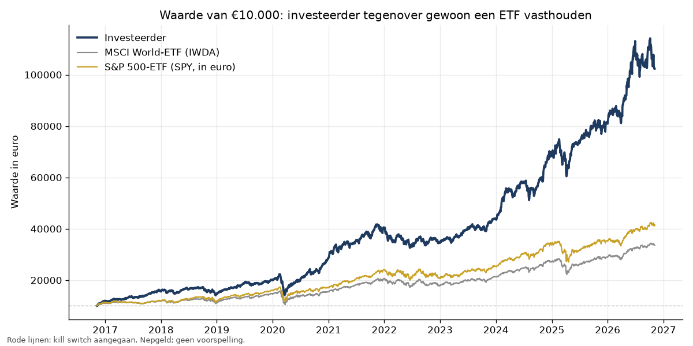

# Backtest investeerder

Periode **2016-11-03 t/m 2026-11-03** (ongeveer 10 jaar), startkapitaal €10.000 nepgeld, 131 instrumenten met koersdata. Zelfde regels, kosten en slippage als bij het dagelijks oefenen.

> Dit is geen voorspelling. Het laat zien hoe deze regels het in het verleden hadden gedaan.

## In het kort

- Over de hele periode deed de investeerder het beter dan gewoon de wereld-ETF vasthouden (+895,2% tegen +240,7%).
- Zijn grootste daling was -36,7%, tegen -33,6% voor de ETF.
- In 69% van alle periodes van 4 weken stond de investeerder aan het eind hoger dan aan het begin. Het slechtste blok van 4 weken was -36,5%, het beste +25,8%.

## Totaal

| | Totaal | Per jaar | Grootste daling | Sharpe | Eindwaarde |
| --- | --- | --- | --- | --- | --- |
| Investeerder | +895,2% | +25,8% | -36,7% | 1,32 | €99.382 |
| MSCI World-ETF (IWDA) | +240,7% | +13,0% | -33,6% | 0,87 | €34.069 |
| S&P 500-ETF (SPY, in euro) | +320,3% | +15,4% | -33,1% | 0,83 | €42.027 |

_Sharpe: rendement gedeeld door beweeglijkheid. Boven 1 is goed, onder 0,5 matig._

## Per kalenderjaar

| Jaar | Investeerder | MSCI World-ETF (IWDA) | S&P 500-ETF (SPY, in euro) |
| --- | --- | --- | --- |
| 2016 | +19,5% | +11,0% | +13,0% |
| 2017 | +32,7% | +7,5% | +7,8% |
| 2018 | -5,5% | -4,2% | -0,4% |
| 2019 | +34,7% | +29,6% | +34,0% |
| 2020 | +43,1% | +6,2% | +7,8% |
| 2021 | +41,1% | +32,5% | +39,8% |
| 2022 | -13,9% | -13,5% | -13,1% |
| 2023 | +24,0% | +19,9% | +21,5% |
| 2024 | +51,9% | +27,2% | +32,8% |
| 2025 | +18,6% | +7,1% | +4,3% |
| 2026 | +26,8% | +15,6% | +17,2% |

## Periodes van 4 weken (20 handelsdagen)

Dit beantwoordt de vraag "wat kan er in een paar weken gebeuren?": elk mogelijk blok van 4 weken in de periode.

| | Hoger geëindigd | Normaal (mediaan) | Slecht (1 op 20) | Slechtste | Beste |
| --- | --- | --- | --- | --- | --- |
| Investeerder | 69% | +2,1% | -5,9% | -36,5% | +25,8% |
| MSCI World-ETF (IWDA) | 67% | +1,4% | -5,7% | -31,2% | +23,9% |
| S&P 500-ETF (SPY, in euro) | 67% | +1,6% | -5,7% | -31,0% | +24,3% |

## Trades

- Aankopen: 271, afgesloten: 292, waarvan winst: 74%
- Gemiddelde winst: €384, gemiddeld verlies: €-264, profit factor: 4,13
- Gemiddeld vastgehouden: 68 dagen; totale kosten: €687
- Kill switch aangegaan: 0 keer

## Belangrijke kanttekeningen

- **Survivorship bias.** De lijst instrumenten is in 2026 gekozen. Aandelen die de afgelopen jaren groot zijn geworden (Nvidia, Palantir, Rheinmetall) staan er daardoor in, en verliezers die uit de indexen zijn verdwenen niet. De echte uitkomst was waarschijnlijk minder goed.
- **Klein risico per trade.** Met 0,25% risico per trade is de agent vaak maar voor een deel belegd. Daardoor zijn zowel winst als verlies kleiner dan bij de ETF.
- **Gratis koersdata** van Yahoo Finance kan fouten of gaten bevatten.
- **Na de kill switch** doet de backtest alsof jij na 5 handelsdagen 'resume' doet.
- Een goed resultaat in het verleden is geen toestemming om met echt geld te handelen.

